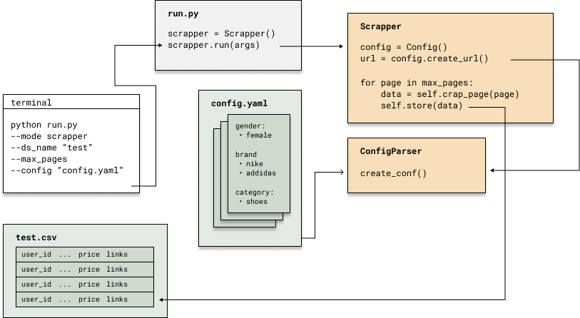

# Scientific Python - Final Project

## Short description
The motivation behind this project was to optimize online shopping for second hand clothes. Instead of clicking through the webstore and configuring your search there, we wanted a solution that transforms the graphical interface into a .csv file that can then be analysed efficiently.
We realised this by an interactive **web scrapper** with an **user interface** based on the browser, where the user is able to filter the search and **annotate** the scrapped data. There is also an option to scrape every listing a user has. The scrapper works on the webstore of Vinted.com. Furthermore, the data provided by the webscrapper will be analyzed regarding differences in clothes for women and men. This analysis is done in the AnalysisVintedStore.ipynb and can be followed there.

## Requirements
For the scrapper to run 
Please activate the scipy environment that we used in this course:
``` conda activate scipy ```

We need some additional packages:

Install python requirements using pip:  
```pip install -r requirements.txt```  
"
Create conda env using:  
```conda env create -f scrapper.yml ```

Troubleshooting Selenium:
For the use of selenium you might need a specific chromedriver (Chrome version 92 for windows version 93 for linux or mac). If you have problems you can download a chrome driver for the version your browser uses here: https://chromedriver.chromium.org/downloads 
Then you need the replace the default driver under "drivers/chromedriver_win32" or linux64 or mac64(chromedriver_your_operating_system).

## Instructions
Each of the modules has a seperate argument. If you want to run the scrapper in your terminal just type:  
```python run.py --mode scrap --config "config.yaml" --max_page 12 --ds_name "test"```
You can change the maximum number of pages scrapped using the max_page attribute and also the name of the data set that will be created ds_name 

When running the scrapper you have to create or modifiy a config file. In this case this fill will be ```config.yaml```. Within this file you can specify which kind of clothes you want and also define some other parameters such as size, color, brands ect.. When creating the config file the entries should follow this pattern.
As we use the German version of the webstore Vinted you have to use german colors and terms for the categories. In the IdMaps.py file you can find an extensive overview of possible values for these parameters. Please use ue, ae and oe instead of ü,ä and ö respectively.

**config.yaml**
```
args = [
    - {"gender": "female", "category": "turnschuhe", "size": [36, 37], "color": ["rot", "gruen"], "brand": ["nike", "addidas"]}   
    - {"gender": "male", "category": "sportschuhe", "size": [42, 43], "color": ["rot", "tuerkis"], "brand": ["nike", "addidas"]}
    - {"gender": "male", "category": "mantel", "size": ["M", "L"]}
    - {"gender": "female", "category": "ringe", "size": [14.9, 15.3, 15.7]}
    ]
```

or using the yaml type description:
```
args: 
  - 
    brand: 
      - nike
      - addidas
    category: "turnschuhe"
    color: 
      - rot
      - gruen
    gender: femal
    size: 
      - 36
      - 37
  - 
    brand: 
      - nike
      - addidas
    ...
```
resulting urls should look something like:
``` https://www.vinted.de/vetements?color_id[]=1&color_id[]=12&catalog[]=76&catalog[]=1904&time=1628187997&page=5 ```


The second option for the scrapper is searching for an username and scrapping all listings this user has.
``` 
python run.py --mode scrap --name <username> --ds_name <dataset_name>
```

where <username> would be the name of the user and <dataset_name> is the name of the datset.
    
## Example output


## File structure
- data
    - contains the generated csv files with information about the seller, price, color, clothing type
- scripts
    - to eas the handling of the multiple modules we created seperate scripts file for each of the module which are called by using the respective argument when running the main file
- src
    - the code modules for the different functionalities

├── data     
│   └── run0.csv  
│   └── run1.csv  
├── scripts  
│   └── annotator.py  
│   └── scrapper.py  
│   └── trainer.py  

## Visualization of the scrapper
